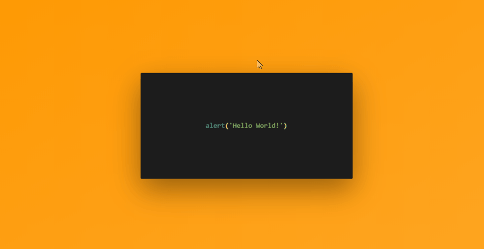

# Website-Designs
> Repo contains basic website designs(No Backend) ,that I developed while learning Bootstrap,Material CSS,Random Messing around :)

> ## About Me :grimacing: 
 

   

## [Travel Website](Website-Designs/Travel-Website1/index.html) (Landing Page)
<ul>
<li> Basic Homepage Design of a travel website.
<li> Used TweenMax for animations and delay(easeInout).
<li> Use of keyframes and pseudoselectors in CSS.
</ul>
 

  

## [Multilayer-Parallax](Website-Designs/Multi-Parallax/index.html) (RellaxJs)
<ul>
<li> As parallax has become a trend and you might are seeing this kind of animations on social media pages related to design inspiration as well
<li>I have tried to manipulate this with multiple layers.
<li>I downloaded an image (attached with source code) from 'unsplash.com' and split it into two layers.
<li>Then after, I rendered clouds and text layers to make it look more realistic and for better user experience.  
</ul>
 

